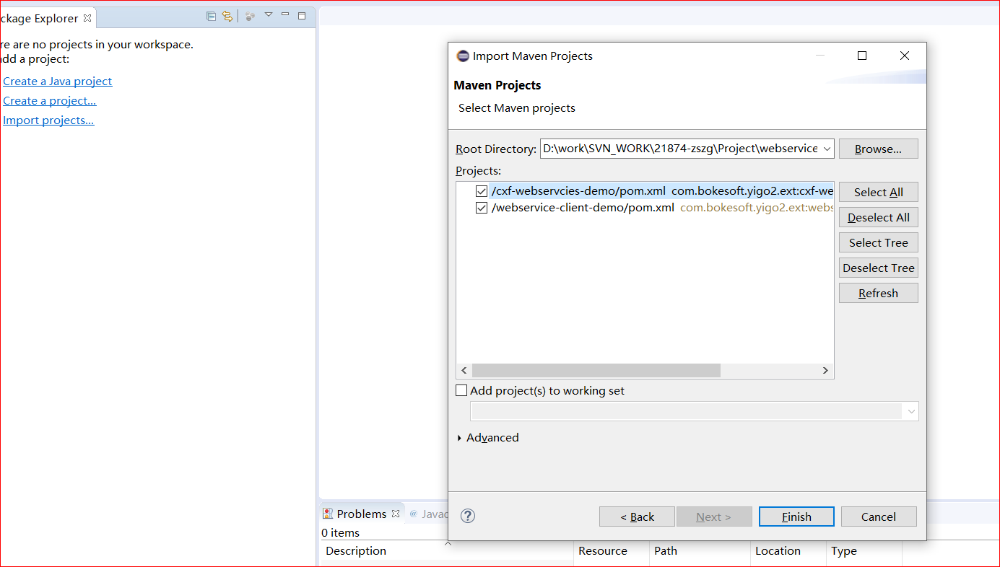

## webservice教程
### 1.安装使用webservice-server
#### 1.1 eclipse的maven环境准备

#### 1.2 eclipse导入webservice-server的maven工程

#### 1.3 maven项目的准备工作

#### 1.4 启动webservice-server,并查看webservice接口服务效果

### 2.安装使用webservice-client

#### 2.1 eclipse的maven环境准备
参照 1.1 (略)

#### 2.2 准备javeee环境,使用webservice-client代码工具

#### 2.3 创建webservice-client工程

##### 2.3.1 webservice-client创建1-新建普通java项目

##### 2.3.1 webservice-client创建2-利用javaEE工具,创建webservice-client

##### 2.3.3 使用代理类,XXXstub调用RPC的API
